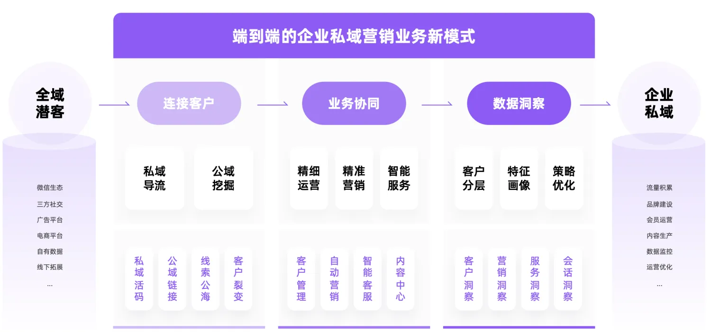
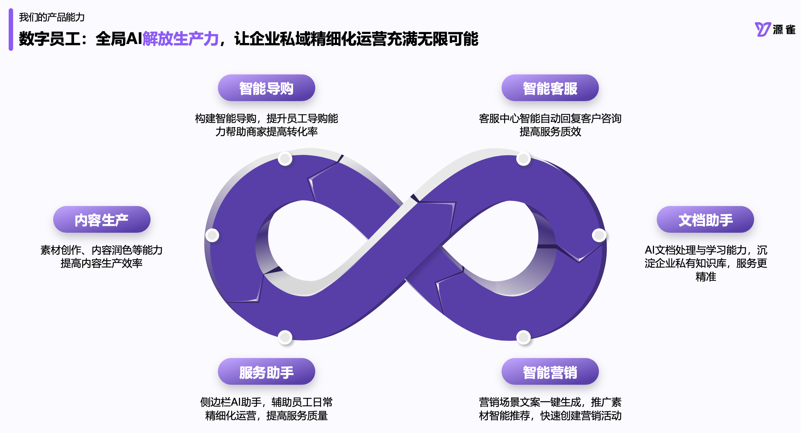
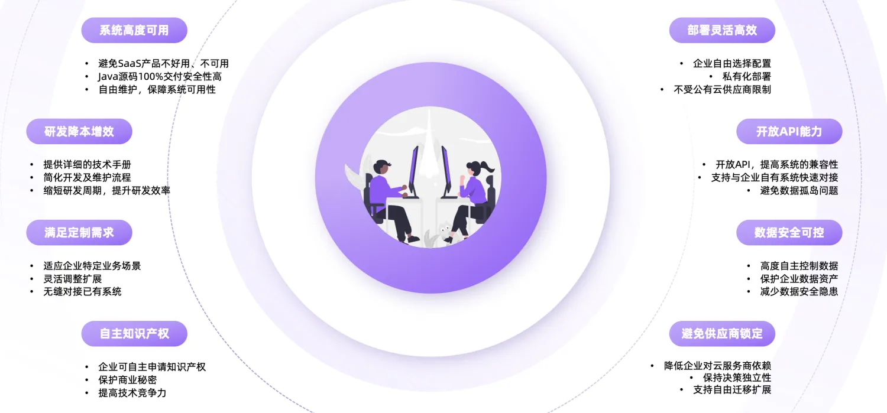
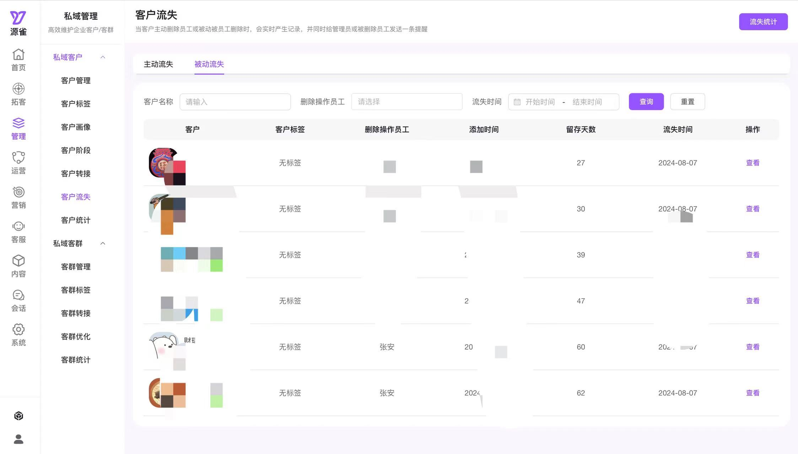
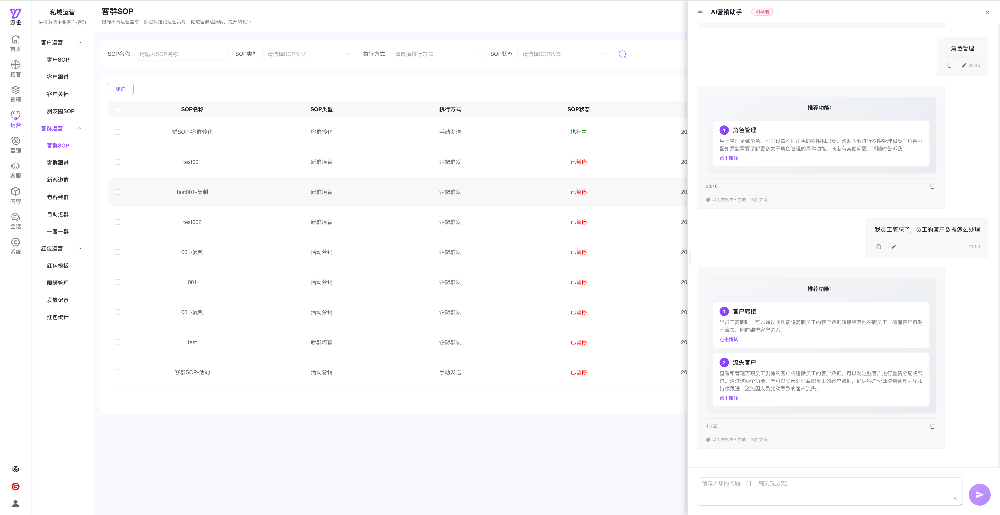
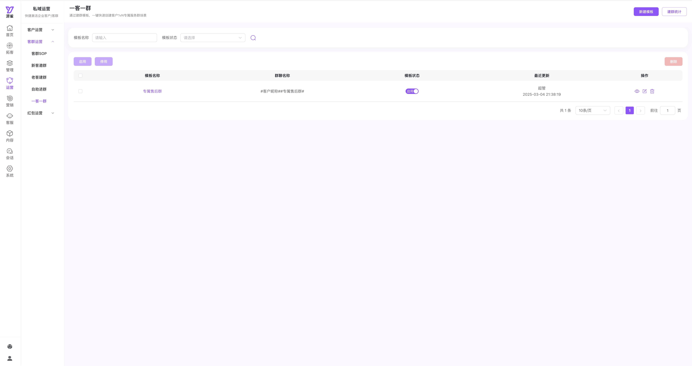
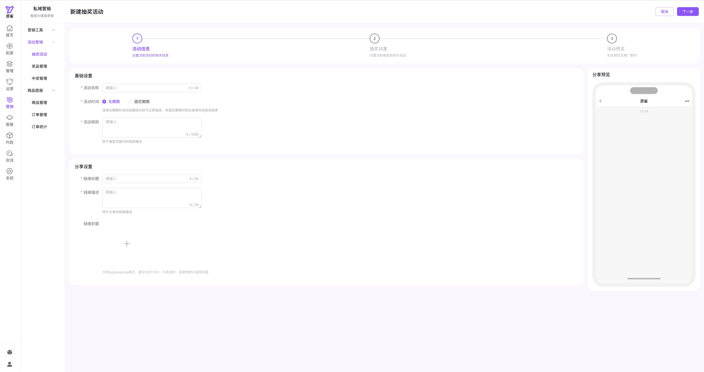

# 源雀 SCRM

**源码 100% 开放的私域数智化营销解决方案**

基于企业微信 · 开箱即用 · 自由定制 · 私有化部署

[English](./README.en.md) | 简体中文

---

## 📌 快速链接

| 资源 | 链接 |
|------|------|
| 🌐 官网 | [iyuanque.cn](https://iyuanque.cn) |
| 📖 开源部署文档 | [iyuanque.cn/docs](https://ucnqq6fany8u.feishu.cn/wiki/OgVfwtC6Sivqjvk85GGcYfVjnyg) |
| 📋 商业版功能清单 | [iyuanque.cn/feature/sy](https://ucnqq6fany8u.feishu.cn/wiki/GItuwa59qiCMlLkRADpc8dxynIe) |
| 🔄 开源版 vs 商业版 | [iyuanque.cn/open-source](https://iyuanque.cn/open-source) |

> 💡 **商业版演示系统**请联系客服获取。开源版暂不提供演示，代码已完全开源可自行部署。

---

## 💡 项目介绍

在过去企业大部分采用 SaaS 模式的 SCRM 标准化产品，能满足一定的需求。但随着企业私域建设的深入以及业务的差异化竞争，SCRM 工具选型面临核心痛点：

- 产品同质化严重，缺乏灵活定制能力
- SaaS 模式与业务脱节，拓展性有限
- 数据安全、隐私保护及合规存在隐患

**源雀 SCRM** 基于源码 100% 开放的交付策略，打通 **"运营、营销、服务三位一体化"** 链路，搭建从全域潜客端到企业私域端的营销新模式，实现 **"开箱即用、自由定制、私有部署、持续服务"** 四大建设目标。

---

## 🏗️ 系统架构

源雀 SCRM 基于 **"拓客 → 管理 → 运营 → 营销 → 服务 → 分析"** 全链路，实现一站式私域数智化营销：

| 链路 | 能力 |
|------|------|
| **拓客** | 全域四大场景规模拓客，低成本快速沉淀私域客户池 |
| **管理** | 基于客户/客群全维度画像，一站式精细管理 |
| **运营** | 基于精细画像，建立自动化运营策略，个性化运营 |
| **营销** | 构建策略人群，全旅程自动精准营销 |
| **服务** | 全渠道微信智能客服 + 内容中心 + 会话存档 + 数字员工 |
| **分析** | 私域全链路数据分析，优化营销策略，驱动业务增长 |

---

## ✨ 核心亮点

| 亮点 | 说明 |
|------|------|
| 🤖 AI 驱动 | 基于 LangChain4j，支持多家模型，可快速切换 |
| 🚀 高可用 | 系统高度可用，部署灵活高效 |
| 💰 降本增效 | 研发降本增效，满足定制需求 |
| 🔒 数据安全 | 数据安全可控，自主知识产权 |
| 🔓 无绑定 | 降低云服务依赖与供应商绑定 |
| ✅ 合规 | 功能接入企业微信官方 API，保证合规性 |

---

## 📦 开源版功能

### 基础功能

**员工智能活码**

- 自动打标签：客户通过定义的活码添加好友，会自动为客户打上相关标签
- 免验证添加：客户扫码添加员工好友，无需员工确认，自动同意
- 重复添加：同一客户扫码，只可添加到指定员工，避免重复
- 多样化欢迎语：可为每个员工定义不同的欢迎语模版
- 活码 Logo 自定义：二维码 Logo 可自行定义
- 自动备注：按照添加时间、标签、渠道名为客户添加自动备注
- 渠道统计：按照时间或渠道维度，统计客户增加流失等情况

**获客外链**

- 通过外部短链自动拉起微信
- 支持自动打标签、免验证添加、防重复添加
- 多样化欢迎语、自动备注、渠道统计

**智能群码**

- 群满自动建群
- 入群自动备注

**客户公海**

- 支持客户线索批量导入以及线索的平均分配
- 通知员工添加线索

**投诉管理**

- 企微投诉入口设置：方便客户反馈问题
- 投诉信息通知管理：多渠道自动下发通知
- 投诉数据统计分析：多维度数据可视化

**群发营销**

- 客户群发：选择指定客户，一键群发多种类社交内容
- 客群群发：选择指定客群，一键群发多种类社交内容

**客户列表 | 员工列表 | 客群列表**

- 同步企业员工列表与客户、客群列表，方便快速查看

**客户标签 | 客群标签**

- 多维度管理企业标签和群标签

**内容**

- 普通素材：统一管理企业标准素材（文字、图片、图文链接）
- 组合话术：统一设置企业通用话术，员工在移动端快速查找并发送

**客服**

- 排班客服：智能管理客户接入与客服接待时效

**配置**

- 操作日志：查看操作日志，便于问题追溯
- 群机器人：自动化消息推送工具
- 文件安全：智能检测 + 日志追溯双机制
- 截屏安全：行为监测 + 智能追溯双重机制

### AI 功能

**AI 智能助手**

- AI 营销通用营销助手：基于大模型协助用户做营销策划
- AI 智能导航：根据用户场景描述，自动推荐功能引导

**AI 客服**

- AI 知识库管理：基于 RAG 架构，实现多格式文档智能解析，构建高性能 Milvus 向量知识库
- AI 客服管理：无缝对接企业微信，集成 RAG 知识引擎，智能语义匹配自动应答
- 服务记录：自动记录客户聊天内容，便于后续 AI 智能分析
- AI 会话总结：通过 AI 大模型自动分析对话记录，生成简明总结报告

**AI 客户会话**

- 会话内容：拉取员工与客户的文本聊天内容
- AI 会话预审：结合 AI 对聊天内容进行分析，判断员工是否有违规行为
- AI 意向客户：通过 AI 进行上下文分析，判断是否为意向客户

**AI 客群会话**

- 会话内容：拉取员工在客群中的文本聊天内容
- AI 会话预审：对群聊内容进行 AI 分析，判断违规行为
- AI 意向群友：分析群成员聊天内容，识别潜在意向客户

**AI 会话洞察**

- 热词管理：多维度设定客户聊天热词
- AI 热词分析：借助 AI 大模型分析客户聊天内容，洞察客户兴趣

**AI 智能标签库**

- AI 客户标签：通过描述需求，让大模型规划企业客户标签
- AI 客群标签：通过描述需求，让大模型规划企业客群标签

> 📋 开源版功能会根据产品实际情况，持续开放更多能力。

---

## 🛠️ 技术栈

| 层级 | 技术 |
|------|------|
| **后端** | Spring Boot + JPA + MyBatis-Plus + MySQL（内置，开箱即用）|
| **前端** | Vue 3 + Vite + Pinia + Element Plus |
| **AI** | LangChain4j + 智谱 AI 等大模型 + Milvus 向量数据库 |

---

## 🤖 AI开发

### Open WeCom Skills — 企微 AI 开发知识库

在使用源雀 SCRM 进行 **二次开发** 或 **企微 API 对接** 时，推荐配合 Open WeCom Skills —— 一套为 AI 大模型优化的企微开发结构化知识体系。

| 维度 | 说明 |
|------|------|
| SKILL 数量 | 41 个 |
| API 覆盖 | 550+ 接口 |
| 代码模板 | Python / TypeScript / Go / Java / PHP 五语言 |
| MCP 接入 | 一行命令，让 AI 精通企微全部 API |

📖 [文档站](https://openwecom.com) · [GitHub](https://github.com/OmniSocKit/Open-Wecom-Skills) · [Gitee](https://gitee.com/omni-soc-kit/open-wecom-skills)

---

## 🖥️ 商业版页面展示

---

## 🏆 获奖荣耀

<a href="https://vs.iyuanque.cn/#awards" target="_blank">查看获奖荣耀</a>

---

## 📄 版权说明

该项目在保留相关 Logo、产品名称等信息，并遵循 [Apache 2.0](LICENSE) 协议的前提下，可自行二开与商用。

---

## 🙏 特别鸣谢

本项目在开发过程中，使用或参考了以下优秀的开源项目/组件，特此表示感谢：

- **ruoyi-ai** — 参考其知识库相关功能
- **LangChain4j** — Java 生态的 LLM 应用开发框架，简化 AI 集成
- **WxJava** — 引用该组件实现企微接口的调用

---

## 📞 联系我们

如有包括但不限于以下需求，可随时通过源雀官方企微联系我们：

- 开源项目技术答疑
- 获取源雀 SCRM 完整体验系统
- 源雀 SCRM 商务合作
- 源雀 SCRM 产品交流
- 更多咨询或服务…

