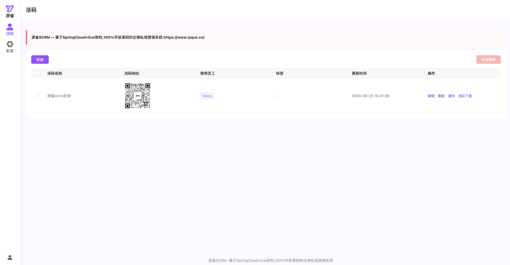
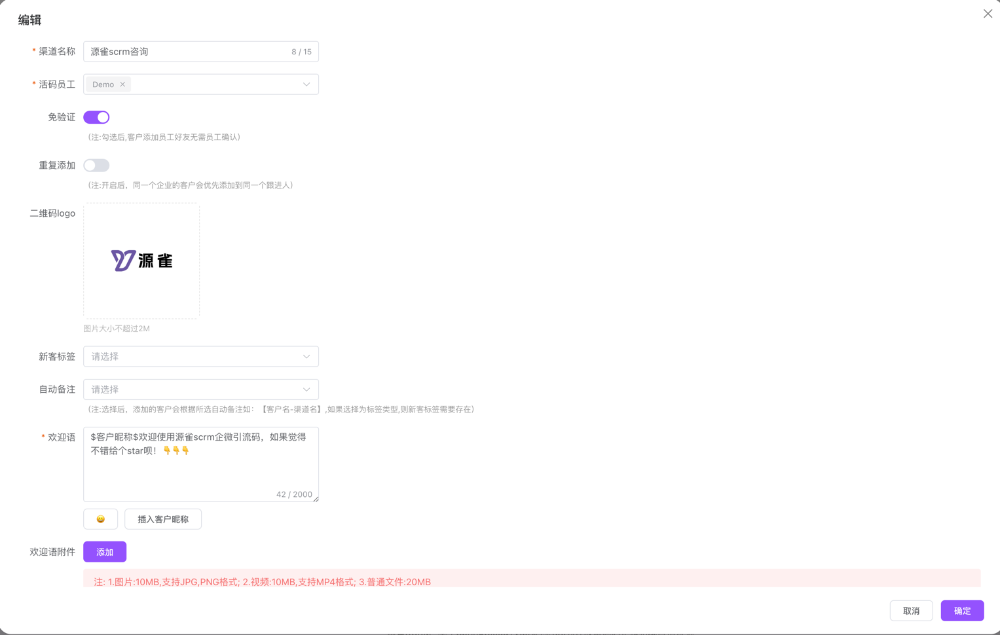

# 企微scrm引流码-iCode:企微增强版活码工具

#### 介绍
&nbsp;&nbsp;&nbsp;随着企业微信（企微）的广泛应用，其内置的活码功能在满足企业多样化的营销需求方面发挥了重要作用。然而，在实际应用中，企微活码功能存在一些局限性，如无法为每个用户单独定制欢迎语、无法明确每个渠道活码的统计情况以及无法为添加的客户自动打标签等。为了解决这些问题，我们推出了企微活码的增强版——iCode。
#### 特别赞助
<div style="display: flex; justify-content: center; align-items: center;">
  <div style="text-align: center;">
    <a href="https://www.iyque.cn?utm_source=iyquecode" target="_blank">
      
    </a>
    <br/>
    <a href="https://www.iyque.cn?utm_source=iyquecode" target="_blank">
      源雀SCRM — 100%开放源码的全链路企微私域营销系统
    </a>
  </div>
</div>
### 软件架构
   ##### 后端:采用springboot+jpa+h2架构,项目内置h2数据库,开箱即可使用。
   ##### 前端:技术栈采用 [[vue3](https://cn.vuejs.org/) [vite](https://cn.vitejs.dev/) [pinia](https://pinia.vuejs.org/zh/) [element-plus](https://element-plus.gitee.io/zh-CN/)]
  ```
  ├── icode-ui		
      ├── public                     # 静态资源
      │   │── static                 # 用于绝对路径的非打包资源，公用基础css等
      │   │── favicon.ico            # favicon图标
      ├── src                        # 源代码
      │   ├── api                    # 后端公共接口请求
      │   ├── assets                 # 主题 字体 svg icons 等静态资源
      │   ├── components             # 全局公用组件
      │   ├── layout                 # 全局基础布局结构组件
      │   ├── router                 # 路由 权限管理等
      │   ├── stores                 # 全局 pinia store管理
      │   ├── styles                 # 全局样式
      │   ├── utils                  # 全局公用方法
      │   ├── views                  # 业务功能所有页面
      │   ├── App.vue                # 入口页面
      │   ├── config.js              # 全局配置文件
      │   ├── main.ts                # 入口文件 加载组件 初始化等
      ├── babel.config.js            # babel-loader 配置
      ├── sys.config.ts                    # 环境变量配置
      ├── index.html                 # html模板
      ├── jsconfig.json              # jsconfig 配置 快捷路径等
      ├── package.json               # package.json
      ├── vite.config.ts             # vite 配置
  ```

#### 功能介绍
* 自动打标签
  * 客户通过定义的活码添加好友会，会自动为客户打上相关的标签。
* 免验证添加
  * 客户扫码添加员工好友,无需员工确认，自动同意。
* 重复添加
  * 同一客户扫码，只可添加到指定员工，避免客户防止客户添加多个员工。
* 欢迎语
  * 可为每个员工定义不同的欢迎语模版。
* 更多
  * 后续会围绕不断更新诸如:渠道统计，欢迎语附件，临时活码,外链活码等相关功能。
  * <a href="https://docs.qq.com/sheet/DRVJoZnVUSG5nZHpr?tab=BB08J2" target="_blank">《企微scrm引流码需求收集表》</a>
#### 应用演示
  地址:https://iyque.cn/tools/  &nbsp;&nbsp;账号:iyque  &nbsp;&nbsp;密码:123456
#### 功能截图


#### 安装部署
##### 后端api部署
* 后端配置文件修改
     ```
     application.yml
  
      iyque:
         userName: iyque #系统登录账号
         pwd: 123456 # 系统登录密码
     
     #系统内置了H2数据库,无需安装单独的数据库,username与password可以使用默认的也可自定义
     #数据库控制台默认访问地址: {系统访问前缀}/h2
     datasource:
        url: jdbc:h2:file:./data/mydb;
        username: iyque
        password: 123456
  ```
* 后端应用打包与启动
  * 打包: mvn clean package
  * 启动: nohup java -jar xxx.jar > iyque.log 2>&1 &
##### 前端应用部署
* 前端配置文件修改 <br/>
 &nbsp;&nbsp;&nbsp;在 [sys.config.ts](./sys.config.ts) 中配置开发、生产等各个环境的：接口域名、路由基础路径，页面基础路径等
```js
// 环境变量
const envs = {
  development: {
    DOMAIN: 'https://iyque.cn', // 站点域名，会根据此处域名判断应用环境
    BASE_URL: '/tools/', // 页面路由基础路径 /*/*/，eg：/a/
    BASE_API: 'https://iyque.cn', // 后端api接口地址
  },
  production: {
    DOMAIN: 'https://iyque.cn',
    BASE_URL: '/tools/',
    BASE_API: 'https://iyque.cn',
  },
}

let mode =
  process.env.NODE_ENV == 'development' || !globalThis.document
    ? process.env.VUE_APP_ENV
    : Object.keys(envs).find((e) => envs[e].DOMAIN === window?.location.origin)

export const env = { ...envs[mode], ENV: mode }

// 系统常量配置
export const common = {
  SYSTEM_NAME: '源雀', // 系统简称
  SYSTEM_SLOGAN:
    '<a href="https://www.iyque.cn?utm_source=iyquecode" target="_blank">源雀SCRM -基于SpringCloud+Vue架构,100%开放源码的企微私域营销系统</a> ', // 系统标语
  COPYRIGHT: 'Copyright © 2024 源雀 All Rights Reserved.', // 版权信息
  LOGO: env.BASE_URL + 'static/logo.png', // 深色logo
  COOKIEEXPIRES: 0.5, // token在Cookie中存储的天数，默认0.5天
}
```

* 后端应用打包与启动

**Node 推荐 16.x 及以上版本**

```sh
# 进入项目目录
cd you-project-name

# 安装依赖
npm i
# 或者使用cnpm
npm install -g cnpm --registry=https://registry.npmmirror.com
cnpm i

# 启动开发服务
npm run dev

# 构建生产环境
npm run build
```

#### 系统参数配置
<div style="display: flex; justify-content: center; align-items: center; text-align: center;">
  <div style="border: 1px solid black; padding: 1rem; margin: 1rem;">
    
    <br/>
        <span style="color: red;">添加好友，免费获取系统参数配置手册,以及相关技术问题咨询</span>
  </div>
</div>


#### 感谢
<a href="https://gitee.com/binary/weixin-java-tools" target="_blank">WxJava</a>
</br>
<a href="https://gitee.com/dromara/hutool/" target="_blank">Hutool</a>
</br>
<a href="https://cn.vuejs.org/" target="_blank">Vue</a>


