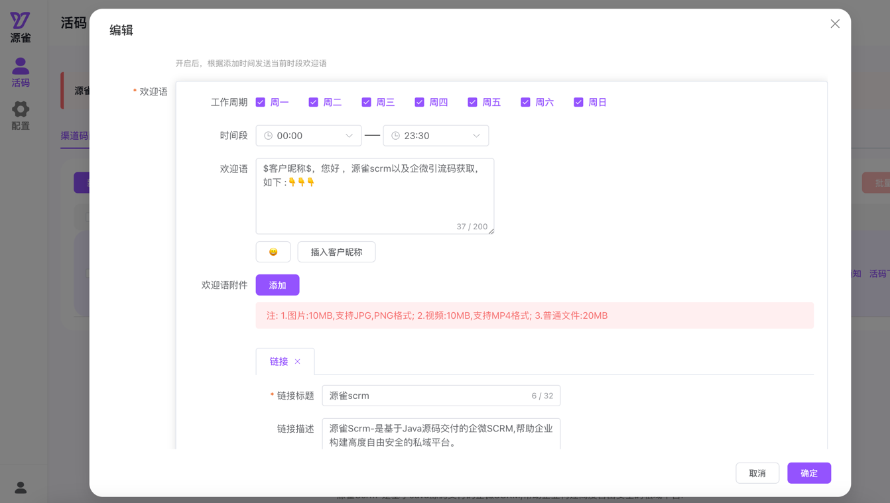

# 企微活码-iYqueCode:企微增强版活码工具

#### 介绍
&nbsp;&nbsp;&nbsp;随着企业微信（企微）的广泛应用，其内置的活码功能在满足企业多样化的营销需求方面发挥了重要作用。然而，在实际应用中，企微活码功能存在一些局限性，如无法为每个用户单独定制欢迎语、无法明确每个渠道活码的统计情况以及无法为添加的客户自动打标签等。为了解决这些问题，我们推出了企微活码的增强版——iYqueCode。
#### 特别赞助
<a href="https://www.iyque.cn?utm_source=iyquecode" target="_blank">

</a>
<br/>
注：源雀SCRM — 基于SpringCloud+Vue架构,100%开放源码的企微私域营销系统-><a href="https://www.iyque.cn?utm_source=iyquecode" target="_blank">
https://iyque.cn
</a>

#### 软件架构
&nbsp;&nbsp;&nbsp;基于Spring Boot框架、Layui前端框架以及内置H2数据库，iYqueCode为企业提供了一套高效、便捷的开箱即用的活码应用解决方案。

#### 功能介绍
* 自动打标签
    * 客户通过定义的活码添加好友会，会自动为客户打上相关的标签。
* 免验证添加
    * 客户扫码添加员工好友,无需员工确认，自动同意。
* 重复添加
    * 同一客户扫码，只可添加到指定员工，避免客户防止客户添加多个员工。
* 欢迎语
    * 可为每个员工定义不同的欢迎语模版。
* 更多
    * 后续会不断更新诸如:渠道统计，欢迎语附件，临时活码等相关功能。
#### 应用演示
   <a href="https://iyque.cn/iyque/" target="_blank">演示地址</a>  账号:iyque 密码:123456
#### 功能截图

#### 安装部署
* 配置文件修改
     ```
     application.yml
  
      iyque:
         userName: iyque #系统登录账号
         pwd: 123456 # 系统登录密码
     
     #系统内置了H2数据库,无需安装单独的数据库,username与password可以使用默认的也可自定义
     #数据库控制台默认访问地址: {系统访问前缀}/h2
     datasource:
        url: jdbc:h2:file:./data/mydb;
        username: iyque
        password: 123456
  ```
* 应用打包与启动
    * 打包: mvn clean package
    * 启动: nohup java -jar xxx.jar > iyque.log 2>&1 &

#### 系统参数配置
* 企微后台自建应用
  
  
  注:可见范围需要选择到部门级，如果选择只是员工，则无法拉取数据。
* 参数获取
  
    * 企业id
      
    * 应用Id与应用Secert
      
    * 可信域名与ip配置(注:域名备案主体需要与企业微信认证主体一致)
      
    * Token与AESKey随机生成即可,最后保存，再将回调地址配置企业微信后台
      

#### 感谢
  <a href="https://gitee.com/binary/weixin-java-tools" target="_blank">开源组件WxJava</a>


